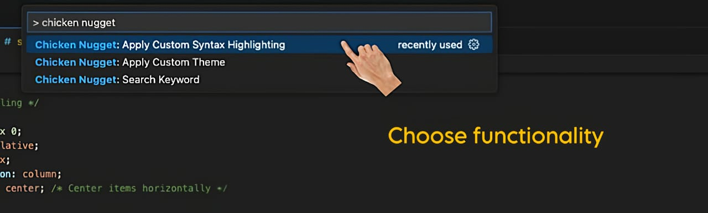
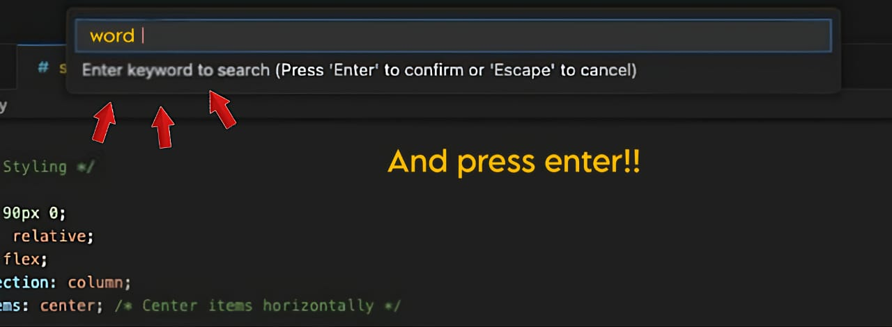
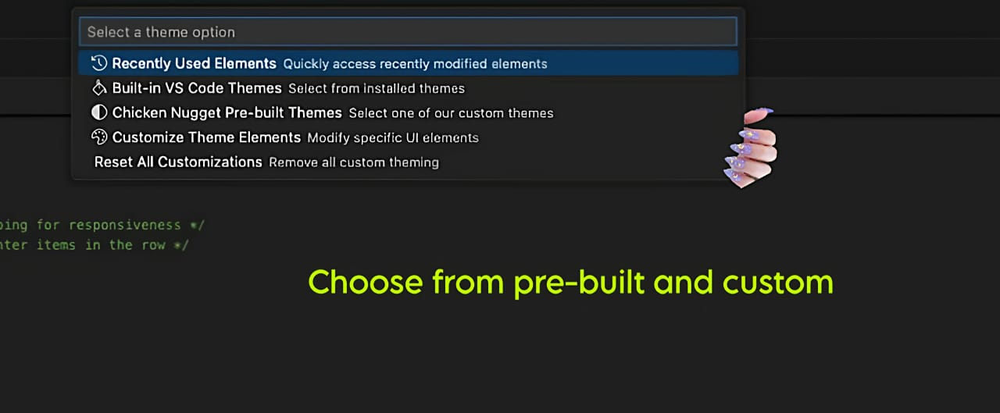
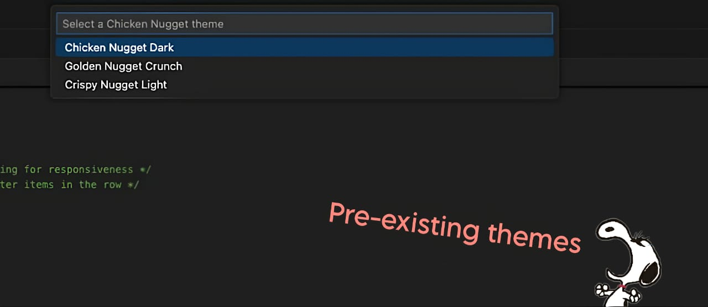
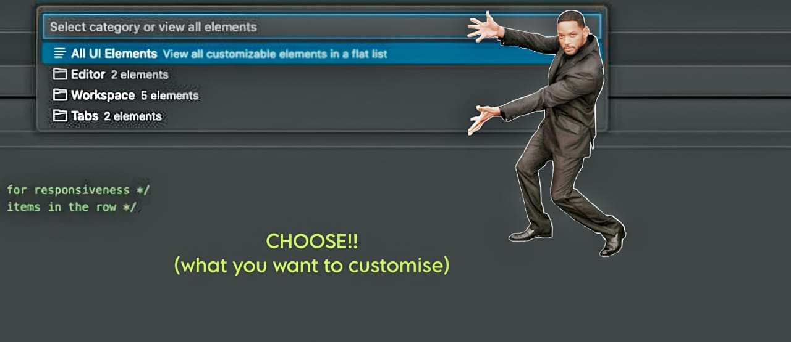
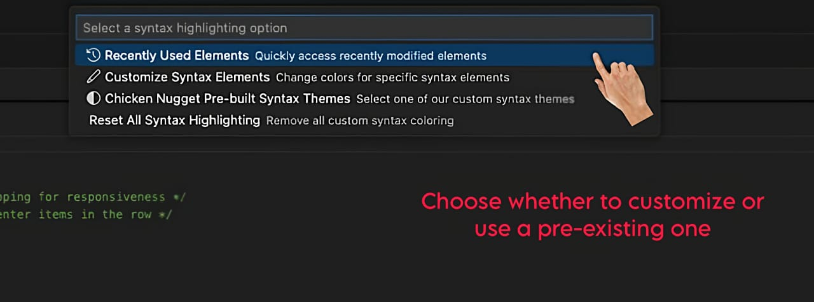
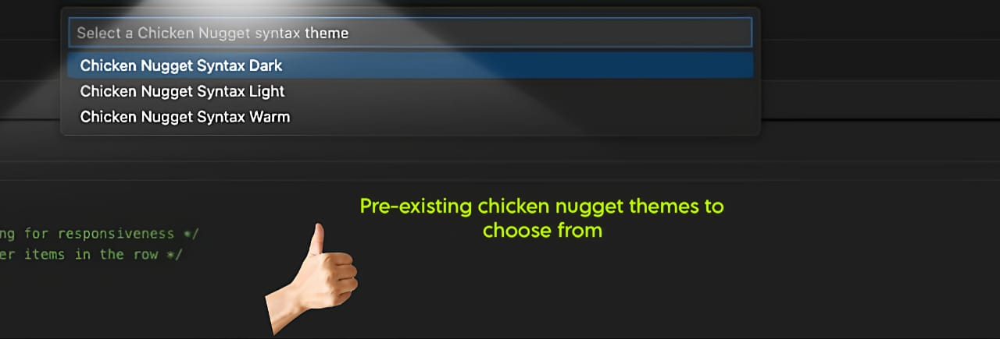
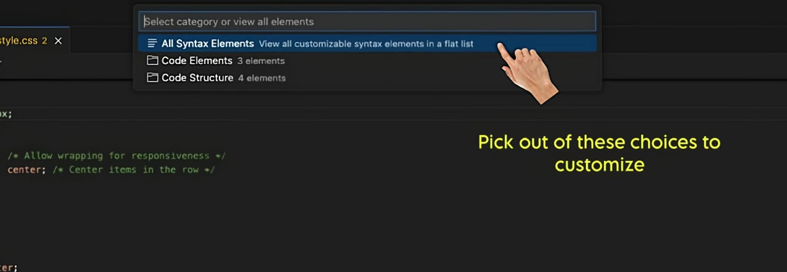
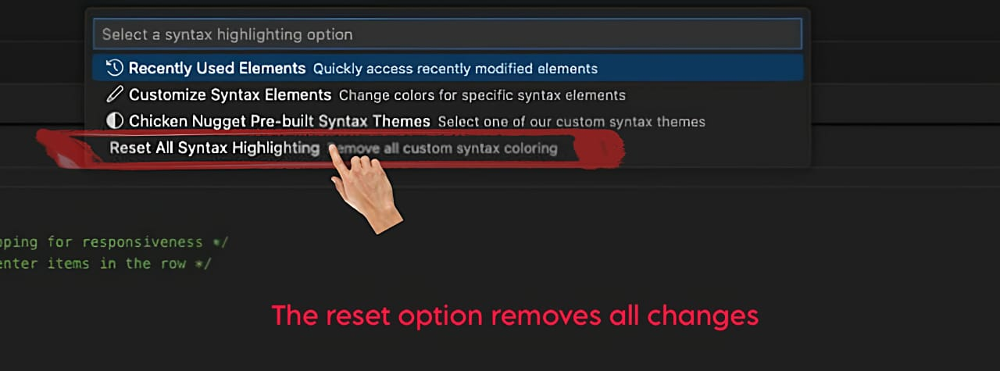

# chicken-nugget README

A powerful VS Code extension that enhances your code navigation and customization experience.

## Features

🔍 **Advanced Code Search**
Quickly find specific elements within your code:

* Search for specific div names, classes, objects, or variables
* Navigate through your codebase with precision
* Regular expression support for complex search patterns

🎨 **Theme Customization**
Transform your VS Code environment:

* Apply complete themes with a single click
* Choose from included preset themes
* Create and save your own custom themes
* Seamlessly integrates with VS Code's theming system
* Theme settings are completely removed when switching back to built-in VS Code themes

🌈 **Syntax Highlighting Personalization**
Fine-tune your coding experience:

* Customize colors for specific syntax elements (comments, strings, functions, etc.)
* Persistent customizations that remain unchanged when switching themes
* Reset custom colors only when manually cleared

## Installation

1. Open VS Code
2. Go to Extensions (Ctrl+Shift+X / Cmd+Shift+X)
3. Search for "Chicken Nugget"
4. Click Install

## Usage

### Advanced Code Search
1. Open the command palette (Ctrl+Shift+P / Cmd+Shift+P)
2. Type "Chicken Nugget: Search Keyword”
3. Type the word to search and press enter
4. Navigate through results in your file

 

 
 

 

 

### Theme Customization
1. Open the command palette (Ctrl+Shift+P / Cmd+Shift+P)
2. Type "Chicken Nugget: Apply Custom Theme"
3. You can choose from the three options: Built-in VS Code Theme, Chicken Nugget Pre-built Themes and       Customise Theme Elements
4. The first two options provide you with pre-existing themes.
5. To customise, click the customise theme elements option and navigate through the options. 
6. In the customise option, you can either edit all UI elements for a complete theme change OR you can choose either of the three elements (editor, workspace, tabs) to change.
7. To reset, use “Chicken Nugget: Reset All Customizations” 

 

 
 

  
 

 

 

### Syntax Highlighting Personalization
1. Open the command palette (Ctrl+Shift+P / Cmd+Shift+P)
2. Type "Chicken Nugget: Apply Custom Syntax Highlighting”
3. Select the customise syntax element and then select the element you want to customise 
4. Choose your preferred color. You can also use the chicken nugget pre-built syntax themes. 
5. To reset, use "Chicken Nugget: Reset All Syntax Highlighting” 

 

 
 

 
 

 
 

 
 

 
 

**THIS FUNCTION IS AVAILABLE IN BOTH THEMES AS WELL AS SYNTAX HIGHLIGHTING.** 
 

## Release Notes
### 1.0.0
* Initial release with Advanced Code Search
* Theme customization system with presets
* Syntax highlighting personalization

## License
This extension is licensed under the Apache License, Version 2.0.

 

**Enjoy tasteful coding?🤔**
